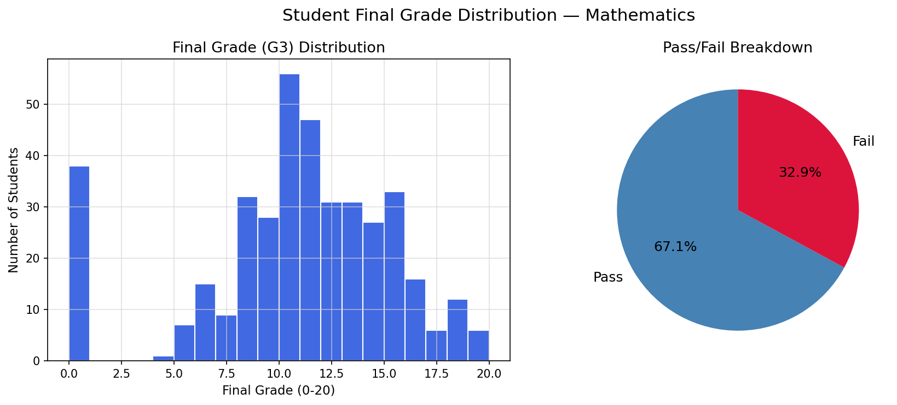
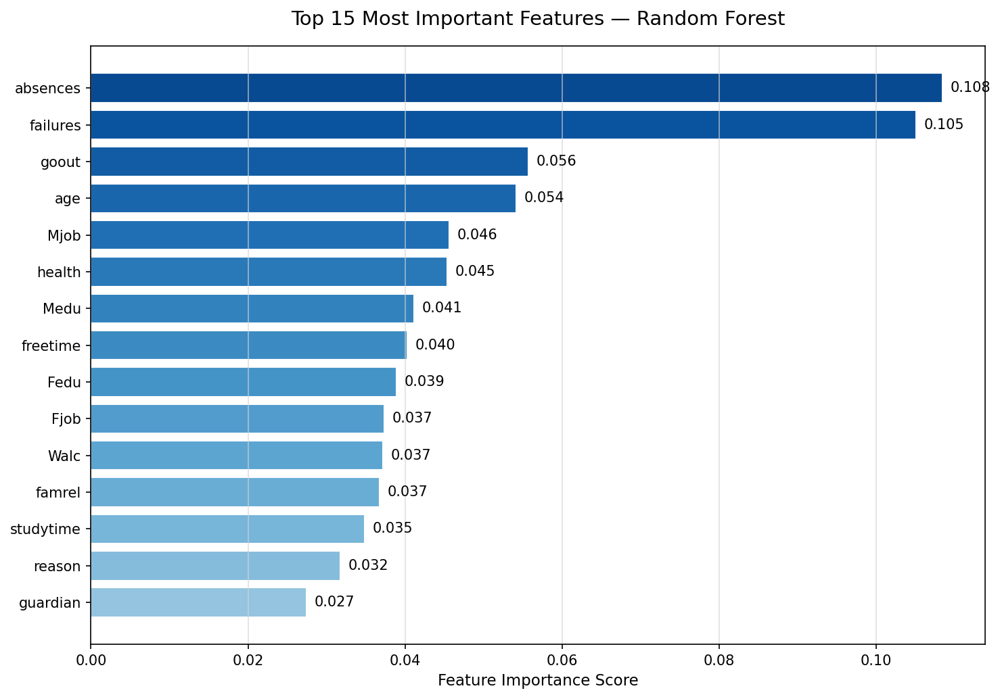
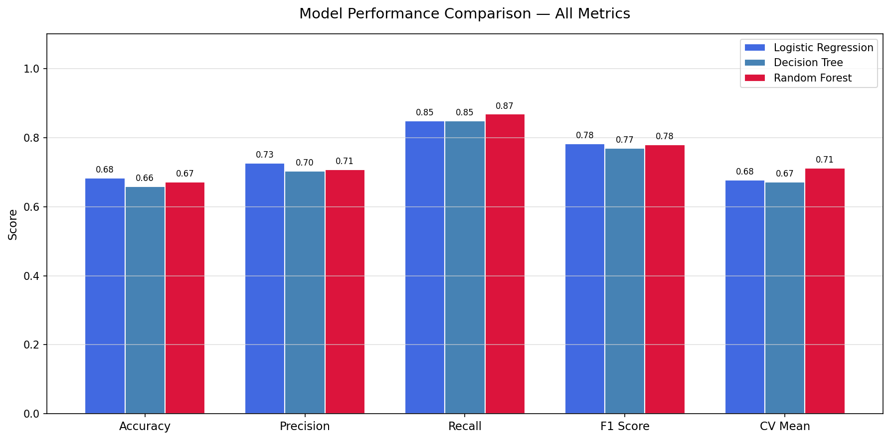
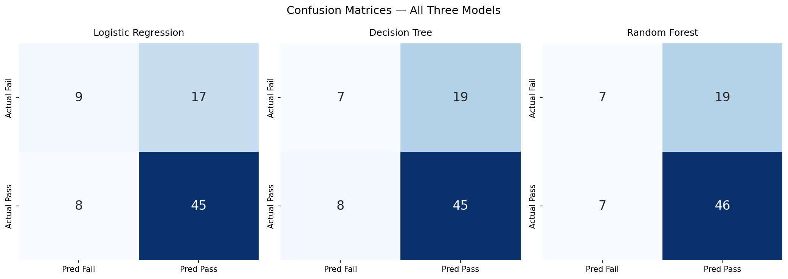

# 🎓 Student Performance Prediction System

> A machine learning project predicting student academic outcomes using behavioral, demographic, and social factors — built with Python and Scikit-learn.

---

## 👋 About This Project
This project builds a machine learning model to predict whether a secondary school student will pass or fail their Mathematics exam using only behavioral, demographic, and social factors — without any grade information. It was built independently using real UCI data as part of my data science learning journey, with the goal of demonstrating how predictive analytics can support early intervention in education systems.

---

## 📌 Research Question
**Can we predict student academic outcomes using behavioral and demographic factors alone — before any exam results are available?**

---

## 📂 Project Structure
student-performance-prediction/
├── data/
│   ├── student-mat.csv
│   ├── student-por.csv
│   ├── student-merge.R
│   ├── student.txt
│   ├── student_clean.csv
│   ├── student_features.csv
│   └── student_target.csv
├── notebooks/
│   ├── 1_data_cleaning.ipynb
│   ├── 2_eda.ipynb
│   ├── 3_modeling.ipynb
│   ├── 4_evaluation.ipynb
│   ├── chart1_grade_distribution.png
│   ├── chart2_feature_importance.png
│   ├── chart3_model_comparison.png
│   └── chart4_confusion_matrices.png
├── index.html
├── requirements.txt
└── README.md

---

## 🗃️ Dataset
| Field | Details |
|---|---|
| Source | UCI Machine Learning Repository |
| Dataset | Student Performance Data Set |
| Students | 395 secondary school students |
| Features | 30 behavioral, demographic and social factors |
| Target | Pass (G3 >= 10) / Fail (G3 < 10) |
| Link | https://archive.ics.uci.edu/ml/datasets/Student+Performance |

---

## 🛠️ Tools & Methods
- Python 3.12 — core programming language
- Pandas — data cleaning and manipulation
- Scikit-learn — machine learning models
- Plotly — interactive visualizations
- Google Colab — cloud development environment

---

## 📊 Methodology
This project follows a four-stage pipeline:

1. Data Cleaning — encoding categorical variables, creating binary target, preventing data leakage
2. Exploratory Analysis — grade distributions, feature correlations, behavioral analysis
3. Modeling — Logistic Regression, Decision Tree, Random Forest comparison
4. Evaluation — feature importance, learning curves, real-world prediction demonstration

---

## 🔬 Key Findings

### Feature Importance (Top 5)
| Rank | Feature | Importance | Meaning |
|---|---|---|---|
| 1 | absences | 0.1085 | Number of school absences |
| 2 | failures | 0.1051 | Number of past class failures |
| 3 | goout | 0.0557 | Going out with friends frequency |
| 4 | age | 0.0542 | Student age |
| 5 | Mjob | 0.0457 | Mother's occupation |

### Model Performance
| Model | Accuracy | Precision | Recall | F1 Score | CV Mean |
|---|---|---|---|---|---|
| Logistic Regression | 68.4% | 72.6% | 84.9% | 78.3% | 67.7% |
| Decision Tree | 65.8% | 70.3% | 84.9% | 76.9% — | 67.1% |
| **Random Forest ✓** | **67.1%** | **70.8%** | **86.8%** | **78.0%** | **71.2%** |

### Selected Model — Random Forest
- Highest cross-validation score (71.2%) — best generalization
- Highest recall (86.8%) — correctly identifies 87% of at-risk students
- Lowest variance across folds (std=0.038) — most consistent model

---

## 📉 Visualizations

### Grade Distribution & Pass/Fail Breakdown

### Top 15 Most Important Features

### Model Performance Comparison

### Confusion Matrices — All Three Models

---

## 🔍 Interpretation
Absences and past failures dominate all other features — both directly observable by schools in real time. This finding supports a simple early warning system: track attendance and academic history from day one of each term, and flag students showing concerning patterns before final exams.

Surprisingly, study time ranks only 13th in importance. Behavioral context — how students spend time outside school, social habits, family environment — predicts outcomes more strongly than self-reported study hours alone.

The model achieves 86.8% recall, meaning it correctly identifies 87 out of every 100 at-risk students. In an educational intervention context, this is the metric that matters most — missing a struggling student is far more costly than a false alarm.

---

## ✅ Conclusions

This project demonstrates that student academic failure is predictable before it happens. Using only behavioral, demographic, and social data — with no exam grades — the Random Forest model correctly identifies 87% of at-risk students, providing schools with a practical early warning tool.

The two most powerful predictors — absences and past failures — are both observable in real time, meaning a school does not need sophisticated infrastructure to act on these findings. A simple attendance tracking system combined with academic history monitoring could prevent a significant proportion of failures each term.

The finding that social behavior (going out frequency) outranks study time as a predictor challenges the assumption that academic failure is primarily about effort. It points instead to a broader pattern of time allocation, behavioral habits, and home environment — factors that require holistic intervention beyond classroom instruction alone.

Finally, the equity dimension cannot be ignored. Four of the top 15 predictive features relate to parental background — factors students cannot control. Schools that ignore this structural disadvantage will continue to see predictable, preventable failures among students from lower-educated households. Data science does not just identify who is failing — it reveals why, and where systemic change is most needed.

---

## 💼 Policy Recommendations
1. Implement real-time attendance monitoring with automated alerts for at-risk patterns
2. Prioritize intervention after first failure — prevent compounding disadvantage
3. Develop structured after-school programs to reduce unproductive social time
4. Create targeted support for students from lower parental education backgrounds
5. Deploy this model as a term-start screening tool to allocate support resources efficiently

---

## ⚙️ How to Run
git clone https://github.com/abdifatah-ds/student-performance-prediction
pip install -r requirements.txt
jupyter notebook notebooks/1_data_cleaning.ipynb
jupyter notebook notebooks/2_eda.ipynb
jupyter notebook notebooks/3_modeling.ipynb
jupyter notebook notebooks/4_evaluation.ipynb

---

## 📚 Citations
- UCI Machine Learning Repository — Student Performance Dataset
- Cortez, P. and Silva, A. (2008). Using Data Mining to Predict Secondary School Student Performance. In A. Brito and J. Teixeira Eds., Proceedings of 5th Annual Future Business Technology Conference, Porto, 5-12
- Scikit-learn: Machine Learning in Python, Pedregosa et al., JMLR 12, pp. 2825-2830, 2011
